# ポインタ

ポインタは、メモリアドレスを格納するための変数です。メモリアドレスは、コンピュータのメモリ上の位置を示します。

## 値のコピー

変数を、別の変数に代入したら、元の変数の値がコピーされます。以下のコードを実行してみましょう。

```c
#include <stdio.h>

int main()
{
    int n;
    int m;

    n = 100;
    m = n;
    n = 200;

    printf("n = %d, m = %d\n", n, m);
}
```

このコードを実行すると、`n = 200, m = 100` と表示されます。`n` に `100` を代入した後、`m` に `n` を代入しています。その後、`n` に `200` を代入していますが、`m` には影響がありません。 `m` に `n` を代入したときに、`n` の値がコピーされます。

コンピューターのメモリは、数直線のようにイメージすることができます。変数の箱が並んでいる感じです。また、それぞれの変数に対してメモリの**アドレス** (番地) が存在します。 先程のコードを図にすると以下のようになります。(以下の例では `n` のアドレスを 102、 `m` のアドレスを 103 としています。)



## 値の参照

**ポインタ変数**を使うと、変数のメモリアドレスを**参照**することができます。ポインタ変数の宣言には、変数名の前に `*` (アスタリスク) をつけます。変数のアドレスを取得するには、その変数に `&` をつけます。 ポインタ変数で、その値を参照するには `*` をつけます。以下のコードを実行してみましょう。

```c
#include <stdio.h>

int main()
{
    int n;
    int *p;

    n = 100;
    p = &n;
    n = 200;

    printf("n = %d, *p = %d\n", n, *p);
}
```

このコードを実行すると、`n = 200, *p = 200` と表示されます。以下の図に先ほどのプログラムのイメージ図を示してます。 `n` に `100` を代入した後、`p` に `n` の**アドレス**を代入しています。 その後、`n` に `200` を代入します。`printf` の `*p` は、`p` が参照しているアドレスにある値を示します (ここでは 102番地の値)。そのため、`*p` は `n` の値を参照してるため、 `200` になります。


