# 文字列

**文字列**(string)は、**文字**(character)の並びです。 C 言語では、文字列は文字の配列として表現されます。

文字列は、`"` (ダブルクォーテーション) で囲む必要があります。以下に、文字列を扱うプログラミング例を示します。`str1` と `str2` は、同じ文字列を表しています。初期化するときに、`str1` は `"` を使って初期化されていますが、`str2` は文字の配列を使って初期化されています。文字列の最後には文字列の最後を意味する、`'\0'` (ヌル文字) が必要です (ヌル文字のように、連続したデータの最後尾を意味する特殊なデータのことを番兵(ばんぺい)といいます)。そのため、char 型の配列の長さより 1 小さいサイズまで文字列を格納できます。 `"` で囲まれた文字列は、コンパイラによって自動的にヌル文字が追加されます。

```c
#include <stdio.h>

int main(){
    char str1[] = "TUAT";
    char str2[] = {'T', 'U', 'A', 'T', '\0'};
    
    printf("%s\n", str1);
    printf("%s\n", str2);
}
```

実行結果は以下のようになります。

```txt
TUAT
TUAT
```

以下にイメージ図を示します。char 型の変数が配列として連続して配置されています。文字列の最後には、ヌル文字が追加されています。配列の各要素には一文字ずつ ASCII コードが割り当てられています。ヌル文字は `0` です。 ASCII コード表は[こちら](https://tuatmcc.com/blog/2024-01-26-ascii-table/)を参照してください。


